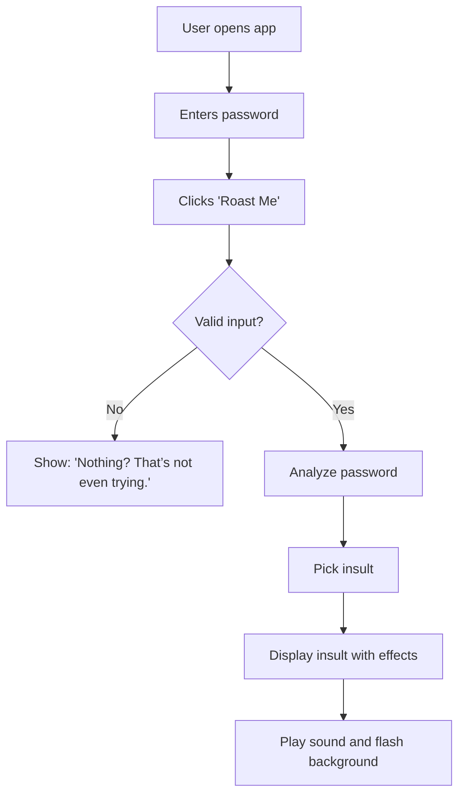

# PASS ROAST 🎯
Live Link: https://pass-roast.vercel.app/

## Basic Details
### Team Name: SV

### Team Members
- Team Lead: VAISHNAVI R - SCMS SCHOOL OF ENGINEERING AND TECHNOLOGY
- Member 2: T R SREELAKSHMI - SCMS SCHOOL OF ENGINEERING AND TECHNOLOGY
  

### Project Description
Pass-Roast is a fun web tool that humorously roasts passwords with playful insults. Just enter a password and click "Roast Me" to get a bold, animated burn along with sound effects.

### The Problem (that doesn't exist)
People are using passwords like 123456, password, and their pet's name — and no one's publicly shaming them for it. Clearly, the internet lacks tough love for bad passwords.

### The Solution (that nobody asked for)
We created a web app that serves verbal justice. It roasts weak passwords with savage insults, dramatic text effects, and sarcastic sound effects — making cyber-shame great again.

## Technical Details
### Technologies/Components Used
For Software:
. Languages used: HTML, CSS, JavaScript
. Frameworks used: None (because raw burns need raw code)
. Libraries used: None — it’s pure vanilla JS roast
. Tools used: Any web browser, Notepad++, VS Code

### Implementation
For Software:
# Installation
No installation needed! Just open the HTML file in any modern browser.

# Run
1.Open index.html
2.Type your password
3.Click Roast Me
4.Cry a little

### Project Documentation
For Software:
All code is commented for readability.
Audio files are embedded via links for dramatic effect.
The typing effect simulates a slow, painful roast.
Responsive layout works on mobile and desktop.

# Screenshots (Add at least 3)

landing page

user enters the password and gets roasted.

# Diagrams

### Project Demo
# Video

## Team Contributions
- [Name 1]: [Specific contributions]
- [Name 2]: [Specific contributions]
- [Name 3]: [Specific contributions]

---
Made with ❤️ at TinkerHub Useless Projects 

